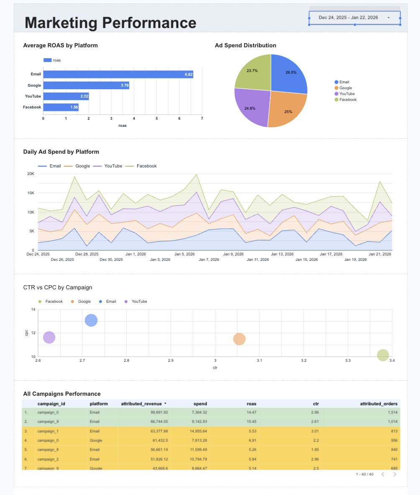
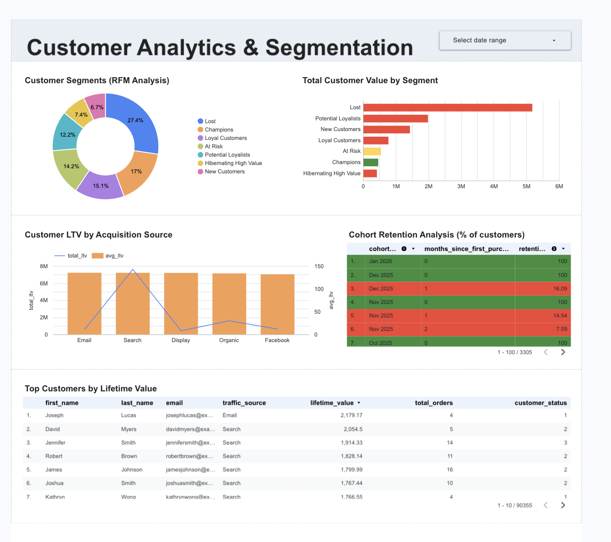
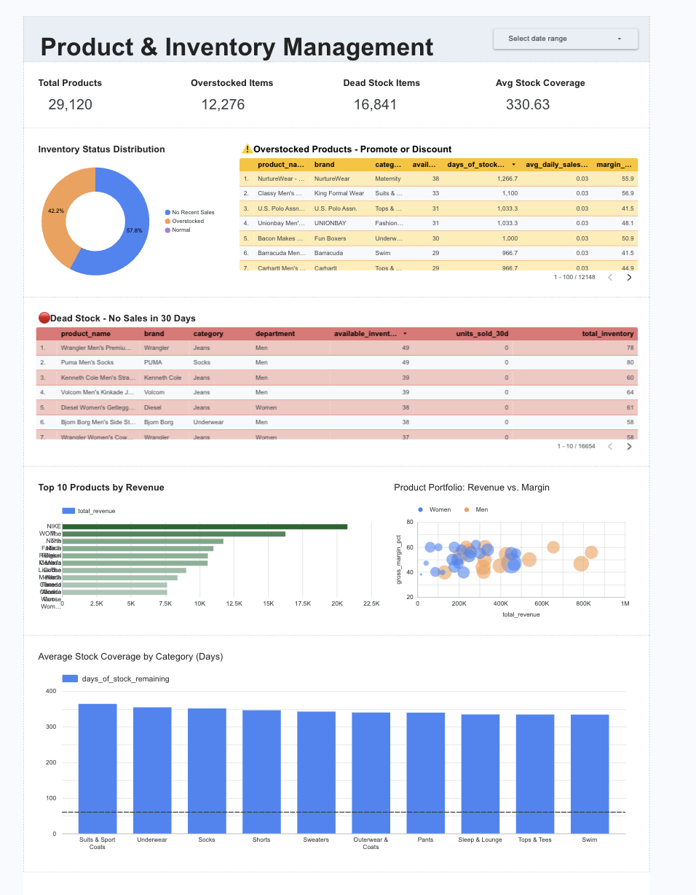

# E-commerce Profit & Growth Command Center

**A comprehensive analytics platform for e-commerce profitability, marketing attribution, and inventory optimization**


---

## 📋 Table of Contents

- [Business Problem](#business-problem)
- [Solution Overview](#solution-overview)
- [Tech Stack](#tech-stack)
- [Project Architecture](#project-architecture)
- [Key Features](#key-features)
- [Results & Insights](#results--insights)
- [Technical Highlights](#technical-highlights)
- [Dashboard Pages](#dashboard-pages)
- [Setup Instructions](#setup-instructions)
- [Contact](#contact)

---

## 🎯 Business Problem

Small to medium-sized e-commerce businesses face critical challenges:

- **Lack of visibility** into real-time profitability and marketing ROI
- **Inefficient marketing spend** across multiple channels (Google, Facebook, YouTube, Email)
- **Poor customer retention** - unable to identify at-risk segments or optimize lifetime value
- **Inventory mismanagement** - overstocked items tying up capital, or stockouts losing sales
- **No actionable insights** - data exists but isn't transformed into business decisions

**The Cost:** Wasted marketing budgets, lost revenue from inventory issues, and missed opportunities to retain valuable customers.

---

## 💡 Solution Overview

Built an end-to-end analytics platform that provides executives and analysts with:

1. **Real-time profitability tracking** - Daily revenue, spend, ROAS, and gross profit monitoring
2. **Multi-channel marketing attribution** - Track which campaigns and platforms drive actual conversions
3. **Customer lifetime value analysis** - RFM segmentation and cohort retention tracking
4. **Inventory forecasting** - Identify overstocked and dead stock with reorder recommendations

The platform transforms raw transactional data into strategic business intelligence through a modern data stack.

---

## 🛠️ Tech Stack

| Layer | Technology | Purpose |
|-------|-----------|---------|
| **Data Warehouse** | Google BigQuery | Scalable cloud data warehouse |
| **Data Source** | The Look E-commerce (public dataset) | ~100K orders, 2.4M events, 29K products |
| **Transformation** | dbt Cloud | ELT pipeline with staging → intermediate → marts |
| **Visualization** | Google Looker Studio | Interactive dashboards |
| **Version Control** | Git/GitHub | Code versioning and collaboration |
| **Data Quality** | dbt Tests | Automated data validation |

---

## 🏗️ Project Architecture

```
┌─────────────────┐
│  Source Data    │
│  - Orders       │
│  - Products     │
│  - Events       │
│  - Marketing    │
└────────┬────────┘
         │
         ▼
┌─────────────────┐
│   BigQuery      │
│   (Raw Layer)   │
└────────┬────────┘
         │
         ▼
┌─────────────────┐
│   dbt Models    │
│                 │
│  Staging ──┐    │
│            │    │
│  Intermediate   │
│            │    │
│  Marts ────┘    │
└────────┬────────┘
         │
         ▼
┌─────────────────┐
│ Looker Studio   │
│  (Dashboards)   │
└─────────────────┘
```

### Data Flow

1. **Raw Data** → BigQuery tables (orders, products, events, marketing spend)
2. **Staging Layer** → Clean, standardized data with consistent naming
3. **Intermediate Layer** → Business logic (sessionization, attribution, aggregations)
4. **Marts Layer** → Final analytics tables ready for visualization
5. **Dashboards** → Executive-ready insights and recommendations

---

## ✨ Key Features

### 1. **Web Sessionization Engine**
- Custom 30-minute inactivity window logic using SQL window functions
- Accurate conversion tracking across 2.4M web events
- Enables add-to-cart rate and session-level conversion analysis

**Technical Implementation:**

The sessionization logic uses a multi-step approach with window functions to transform individual events into meaningful user sessions:

```sql
-- Full sessionization logic from int_web_sessions.sql

-- Step 1: Calculate time gaps between consecutive events for each user
WITH events_with_gaps AS (
  SELECT
    *,
    LAG(event_time) OVER (
      PARTITION BY user_id 
      ORDER BY event_time, event_id  -- event_id as tiebreaker
    ) AS prev_event_time,
    TIMESTAMP_DIFF(
      event_time,
      LAG(event_time) OVER (
        PARTITION BY user_id 
        ORDER BY event_time, event_id
      ),
      MINUTE
    ) AS minutes_since_last_event
  FROM events
),

-- Step 2: Flag new sessions based on 30-minute inactivity threshold
session_starts AS (
  SELECT *,
    CASE 
      WHEN prev_event_time IS NULL THEN 1           -- First event for user
      WHEN minutes_since_last_event > 30 THEN 1     -- Inactive > 30 minutes
      ELSE 0                                         -- Same session continues
    END AS is_new_session
  FROM events_with_gaps
),

-- Step 3: Generate sequential session numbers using cumulative sum
-- Each flag of 1 increments the session counter
sessions_numbered AS (
  SELECT *,
    SUM(is_new_session) OVER (
      PARTITION BY user_id 
      ORDER BY event_time, event_id
      ROWS BETWEEN UNBOUNDED PRECEDING AND CURRENT ROW
    ) AS user_session_number
  FROM session_starts
),

-- Step 4: Create globally unique session IDs
final_sessions AS (
  SELECT 
    CONCAT(
      CAST(user_id AS STRING), 
      '-', 
      CAST(user_session_number AS STRING)
    ) AS session_id,
    user_id,
    event_time,
    event_type,
    uri,
    traffic_source
  FROM sessions_numbered
)

SELECT * FROM final_sessions
ORDER BY user_id, event_time, event_id
```

**Key Technical Decisions:**
- **30-minute threshold using `> 30` (not `>=`)**: Industry standard - a gap of exactly 30 minutes is considered same session
- **event_id as tiebreaker**: Ensures deterministic ordering when multiple events have identical timestamps
- **Cumulative sum pattern**: Transforms binary flags (0,1) into sequential session numbers (1,1,1,2,2,3...)
- **Window functions handle out-of-order data**: ORDER BY in OVER clause sorts data regardless of ingestion order
- **UTC timestamps**: All TIMESTAMP types ensure consistent calculations across timezones

**Business Impact:**
- Accurate conversion funnel metrics (15% add-to-cart rate, 2-3% session conversion)
- Enables campaign attribution by linking purchases to session traffic sources
- Powers marketing ROI calculations at the session level

### 2. **Multi-Touch Marketing Attribution**
- Attributes revenue and orders to specific campaigns across 4 channels
- Date and platform matching logic
- Campaign-level ROAS, CPA, and conversion rate tracking

**Impact:** Identified that Email delivers 6.3x ROAS while Facebook only 1.5x - enabling budget reallocation

### 3. **RFM Customer Segmentation**
- Automated classification into 8 segments (Champions, Loyal, At Risk, Lost, etc.)
- Uses Recency, Frequency, and Monetary value quintiles
- Enables targeted retention and re-engagement campaigns

**Business Value:** Discovered 27.4% of customers are "Lost" with $6M in historical value - prime re-engagement target

### 4. **Cohort Retention Analysis**
- Monthly cohort tracking with retention heatmap
- Shows customer behavior patterns over 12+ months
- Identifies drop-off points and retention trends

**Insight:** Retention drops from 100% → 15% by month 1, then stabilizes around 7-11% - typical e-commerce pattern

### 5. **Inventory Forecasting**
- Days-of-stock-remaining calculations
- Average daily sales velocity (30-day rolling)
- Automated reorder quantity recommendations
- Dead stock identification (no sales in 30 days)

**Outcome:** Identified 57.8% of products as dead stock and 42.2% as overstocked - major capital optimization opportunity

---

## 📊 Results & Insights

### Marketing Performance
- **Email Marketing:** 6.3x ROAS - highest performing channel
- **Google Ads:** 3.67x ROAS - solid performer
- **YouTube:** 1.93x ROAS - needs optimization
- **Facebook:** 1.52x ROAS - underperforming, consider budget reallocation

**Recommendation:** Shift 20% of Facebook budget to Email and Google campaigns

### Customer Analytics
- **27.4% of customers** are in "Lost" segment with **$6M in lifetime value**
- **17% are Champions** generating highest revenue per customer
- **Average LTV:** $150-200 depending on acquisition source
- **Email and Search** bring most valuable customers (highest LTV)

**Recommendation:** Launch win-back campaign targeting Lost segment; invest more in Email and SEO

### Inventory Management
- **57.8% products** have no sales in 30 days (dead stock)
- **42.2% products** are overstocked (avg 330 days of inventory)
- **Top 10 products** generate 40% of revenue (Nike leading)
- **Average margin:** 50-60% across product lines

**Recommendation:** Aggressive clearance for dead stock; promotions for overstocked items; focus on top performers

---

## 🔧 Technical Highlights

### Advanced SQL Techniques
- **Window Functions:** `LAG()`, `SUM()`, `ROW_NUMBER()` for sessionization
- **CTEs (Common Table Expressions):** Modular, readable query construction
- **Date Math:** `TIMESTAMP_DIFF()`, `DATE_TRUNC()` for time-based analysis
- **Aggregations:** Complex metrics (ROAS, retention rate, margin %)
- **Joins:** Multi-table relationships preserving data integrity

### dbt Best Practices
- **3-layer architecture:** Staging → Intermediate → Marts
- **Modular models:** 15+ models with clear dependencies
- **Data quality tests:** Uniqueness, not-null, relationships, value ranges
- **Documentation:** Schema.yml files with descriptions
- **Partitioning:** Optimized BigQuery tables for cost reduction

### Data Modeling Decisions

**Sessionization Logic:**
- Chose 30-minute window based on e-commerce industry standards
- Used window functions instead of UDFs for better performance
- Generated unique session IDs: `user_id + session_number`

**Attribution Model:**
- Last-touch attribution (matches purchase to same-day session)
- Platform matching based on traffic source patterns
- Handles unattributed sessions gracefully (nulls)

**Inventory Forecasting:**
- 30-day rolling average for sales velocity (balances recency vs. stability)
- Threshold-based alerting (Critical < 7 days, Low < 14 days)
- Incorporates product cost for reorder value calculations

---

## 📈 Dashboard Pages

### Page 1: Executive Overview
**Purpose:** High-level P&L and marketing performance

**KPIs:**
- Total Revenue (30d): $654.9K
- Total Ad Spend (30d): $107.7K
- ROAS (7-day avg): 5.8x
- Gross Profit (30d): $547.2K

**Visualizations:**
- Revenue vs. Ad Spend dual-axis line chart
- ROAS trend with 7-day moving average
- Top campaigns by ROAS (table)


### Page 2: Marketing Performance
**Purpose:** Deep-dive into campaign and channel performance

**Charts:**
- Average ROAS by Platform (bar chart)
- Ad Spend Distribution (pie chart)
- Daily Ad Spend by Platform (stacked area)
- CTR vs CPC Analysis (scatter plot)
- All Campaigns Performance (table with conditional formatting)



### Page 3: Customer Analytics & Segmentation
**Purpose:** Customer lifetime value and retention analysis

**Charts:**
- Customer Segments Distribution - RFM (donut chart)
- Total Customer Value by Segment (bar chart)
- Customer LTV by Acquisition Source (combo chart)
- Cohort Retention Analysis (heatmap table)
- Top Customers by LTV (table)



### Page 4: Product & Inventory Management
**Purpose:** Inventory optimization and product profitability

**KPIs:**
- Total Products: 29,120
- Overstocked Items: 12,276
- Dead Stock Items: 16,841
- Avg Stock Coverage: 330 days

**Charts:**
- Inventory Status Distribution (donut chart)
- Overstocked Products - Action Required (table)
- Dead Stock - No Sales in 30 Days (table)
- Top 10 Products by Revenue (bar chart)
- Product Portfolio: Revenue vs. Margin (scatter plot)
- Average Stock Coverage by Category (column chart)



---

## 🚀 Setup Instructions

### Prerequisites
- Google Cloud Platform account
- dbt Cloud account (free tier)
- Git installed locally

### 1. Clone Repository
```bash
git clone https://github.com/YOUR_USERNAME/ecommerce-analytics-platform.git
cd ecommerce-analytics-platform
```

### 2. Set Up BigQuery
```sql
-- Create datasets
CREATE SCHEMA `your-project.raw`;
CREATE SCHEMA `your-project.dbt_dev`;
CREATE SCHEMA `your-project.dbt_prod`;

-- Copy The Look E-commerce dataset
CREATE TABLE `your-project.raw.orders` AS
SELECT * FROM `bigquery-public-data.thelook_ecommerce.orders`;

CREATE TABLE `your-project.raw.order_items` AS
SELECT * FROM `bigquery-public-data.thelook_ecommerce.order_items`;

CREATE TABLE `your-project.raw.products` AS
SELECT * FROM `bigquery-public-data.thelook_ecommerce.products`;

CREATE TABLE `your-project.raw.users` AS
SELECT * FROM `bigquery-public-data.thelook_ecommerce.users`;

CREATE TABLE `your-project.raw.events` AS
SELECT * FROM `bigquery-public-data.thelook_ecommerce.events`;

CREATE TABLE `your-project.raw.inventory_items` AS
SELECT * FROM `bigquery-public-data.thelook_ecommerce.inventory_items`;
```

### 3. Generate Marketing Data
```sql
-- Create marketing spend table
CREATE TABLE `your-project.raw.marketing_spend` (
  date DATE,
  campaign_id STRING,
  platform STRING,
  spend FLOAT64,
  clicks INT64,
  impressions INT64
);

-- Insert sample data (2019-2026)
INSERT INTO `your-project.raw.marketing_spend`
SELECT
  date,
  CONCAT('campaign_', CAST(MOD(EXTRACT(DAYOFYEAR FROM date), 10) AS STRING)) as campaign_id,
  platform,
  ROUND(RAND() * 5000 + 1000, 2) as spend,
  CAST(ROUND(RAND() * 500 + 100) AS INT64) as clicks,
  CAST(ROUND(RAND() * 20000 + 5000) AS INT64) as impressions
FROM 
  UNNEST(GENERATE_DATE_ARRAY('2019-01-20', '2026-01-24', INTERVAL 1 DAY)) as date
CROSS JOIN
  UNNEST(['Google', 'Facebook', 'YouTube', 'Email']) as platform;
```

### 4. Configure dbt
```bash
# Update profiles.yml with your BigQuery project details
# Update dbt_project.yml with your project name
```

### 5. Run dbt Models
```bash
dbt deps              # Install packages
dbt run              # Run all models
dbt test             # Run data quality tests
dbt docs generate    # Generate documentation
```

### 6. Connect Looker Studio
1. Go to https://lookerstudio.google.com
2. Create new report
3. Connect to BigQuery
4. Select tables from `dbt_dev` or `dbt_prod`
5. Build visualizations following dashboard structure above

---

## 📁 Project Structure

```
ecommerce-analytics-platform/
│
├── models/
│   ├── staging/
│   │   ├── _sources.yml
│   │   ├── stg_marketing.sql
│   │   ├── stg_orders.sql
│   │   ├── stg_order_items.sql
│   │   ├── stg_products.sql
│   │   ├── stg_users.sql
│   │   ├── stg_events.sql
│   │   ├── stg_inventory.sql
│   │   └── schema.yml
│   │
│   ├── intermediate/
│   │   ├── int_daily_sales.sql
│   │   ├── int_daily_marketing.sql
│   │   ├── int_web_sessions.sql
│   │   ├── int_user_acquisition.sql
│   │   └── int_campaign_attribution.sql
│   │
│   └── marts/
│       ├── fact_daily_pnl.sql
│       ├── fact_daily_pnl_advanced.sql
│       ├── fact_campaign_performance.sql
│       ├── fact_session_metrics.sql
│       ├── fact_cohort_retention.sql
│       ├── fact_product_performance.sql
│       ├── fact_inventory_forecast.sql
│       ├── dim_customers.sql
│       └── dim_customer_segments.sql
│
├── docs/
│   ├── screenshots/
│   └── lineage_graph.png
│
├── dbt_project.yml
├── packages.yml
└── README.md
```

---

## 🎓 Learning Outcomes

Through this project, I demonstrated proficiency in:

**Analytics Engineering:**
- Designing dimensional data models (facts and dimensions)
- Implementing ELT pipelines with dbt
- Building reusable, modular SQL transformations

**Advanced SQL:**
- Window functions for complex analytics
- Cohort analysis and retention calculations
- Attribution modeling
- Sessionization logic

**Business Intelligence:**
- Translating business requirements into data models
- Creating executive-ready dashboards
- Deriving actionable insights from data

**Data Quality:**
- Implementing automated testing
- Ensuring referential integrity
- Handling edge cases and nulls

---

## 📞 Contact

**Your Name**
- Email: omar.ash.abdalla@gmail.com
- LinkedIn: [linkedin.com/in/oabdallapro](https://linkedin.com/in/oabdallpro)
- GitHub: [github.com/omarbinash](https://github.com/omarbinash)

---

## 📄 License

This project is open source and available under the MIT License.

---

## 🙏 Acknowledgments

- **The Look E-commerce Dataset** - Google BigQuery public dataset
- **dbt Community** - For excellent documentation and best practices
- **Anthropic Claude** - For architecture guidance and SQL optimization

---

*Built with ❤️ as a portfolio project demonstrating end-to-end analytics engineering capabilities*
